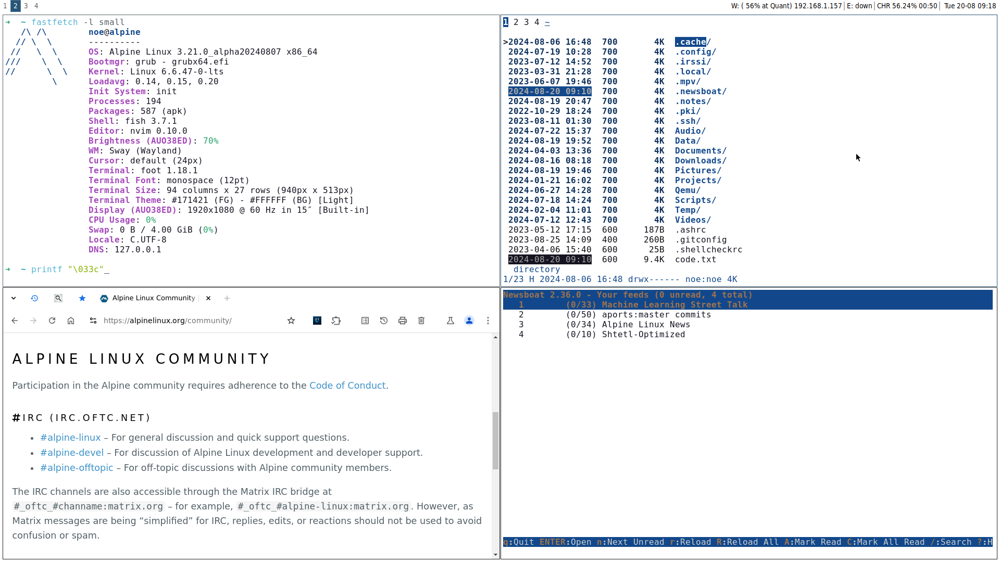

```
       ______
      (      )
       ------
          \   ^__^
           \  (oo)\_______                  s i g h t           ←
              (__)\       )\/\
                  ||----w |
                  ||     ||

```

<br><br>
<em>sight</em> is <em>inter alia</em> an alpine linux/sway post-install script<br>
in a <em>bare-metal</em> context. check [this](https://github.com/llightcb/sight/blob/main/install.sh) out before you start
<br><br>

## 1: basic step

[alpine](https://alpinelinux.org/downloads/) standard | extended | virtual image & [installation](https://docs.alpinelinux.org/user-handbook/0.1a/Installing/manual.html)

```bash
# example
setup-keymap → setup-hostname → setup-interfaces  ↓
  rc-service networking start → setup-timezone    ↓
   setup-apkrepos → passwd → setup-ntp chrony     ↓
rc-update add networking boot → setup-disk → reboot
```

## 2: git, clone

```
# apk add git
# git clone https://github.com/llightcb/sight.git
```

## 3: run script

```
# sh sight/install.sh
```

## 4: finalizing

please take [this](https://gist.github.com/llightcb/5615b2334d89838c5db2ffd43a6c660d) step **before** rebooting | → done

## overview

<p align="center">
  
</p>

## consider

```
 ~ enable xwayland → comment sway config line 2
 ~ resolution, refresh rate sway config line 12
 ~ cursor theme and/or size sway config line 46
 ~ default terminal font - size foot.ini line 7

 - if laptop: $ doas powertop --html=power.html
 ~ hour (daily) for updatedb: $ doas crontab -e
 ~ hour/day (weekly) for trim:      — „ —
 - interrupt key = ctrl+shift+c (ctrl+c = copy)
 ~ $ de /etc/dnscrypt-proxy/dnscrypt-proxy.toml
 | list →  https://dnscrypt.info/public-servers

 $ de /etc/chrony/chrony.conf → consider "nts"
 | an _example_: branch platonic → chrony.conf
 - nvim toogle syntax-check on/off with Ctrl+l
 | check :Plug{Status,Install,Update,Upgrade}∞
 ~ vmsvga: $ set -Ux WLR_NO_HARDWARE_CURSORS 1
 - run $ fwn --sf / $ bll -r /+maybe: $ bll -g
```

## function

```bash
$ chc       # chrony check ntp
$ iso       # wipe -a/-o write
$ img       # img-dir overview
$ esa       # eval: ssh agent
$ 2fa       # two-factor auth
$ cbb       # <cmd> busybox ?
$ cpu       # (oo) → $ cpu -h
$ pkgi      # info: $ pkgi -h
$ sfm       # (oo) → $ sfm -h
$ fwn       # (oo) → $ fwn -h
$ bll       # (oo) → $ bll -h
$ sh2       # sync /home/ to:
$ rcl       # rclog: $ rcl -h
$ vlk       # (v)lock  screen
$ 2s        # (oo) →  $ 2s -h
$ tf        # up @ pb-service
$ ff        # ? → $ ff --help
$ pw        # pass: → $ pw -h
$ cd        # cd + list files
$ nt        # note: → $ nt -h
$ se        # hwmon  coretemp
$ si        # setup streaming
$ gd        # git diff less+c
$ cfn       # cleanup filename
$ info      # (oo) → $ info -h
$ grin      # grub-install/efi
$ mpvl      # mpv localprofile

# fish - abbreviations: $ abbr
```

## testing

```bash
# example

qemu-img \
create -f qcow2 alpine.img 10G

qemu-system-x86_64 \
-m 1024 \
-boot d \
-enable-kvm \
-cpu host \
-smp 3 \
-net nic \
-net user \
-hda alpine.img \
-display gtk \
-cdrom alpine-<x>.iso

# login as root
# setup-alpine¹
# poweroff done

qemu-system-x86_64 \
-m 1024 \
-boot d \
-enable-kvm \
-cpu host \
-smp 3 \
-net nic \
-net user \
-hda alpine.img \
-vga qxl \
-device virtio-gpu-pci \
-display gtk,full-screen=on,gl=on,show-cursor=on,grab-on-hover=on

# login as root
# take step 2,3 and 4 ↑
# reboot system
# login as user
```
→ [ ¹ ](https://docs.alpinelinux.org/user-handbook/0.1a/Installing/setup_alpine.html) ←
